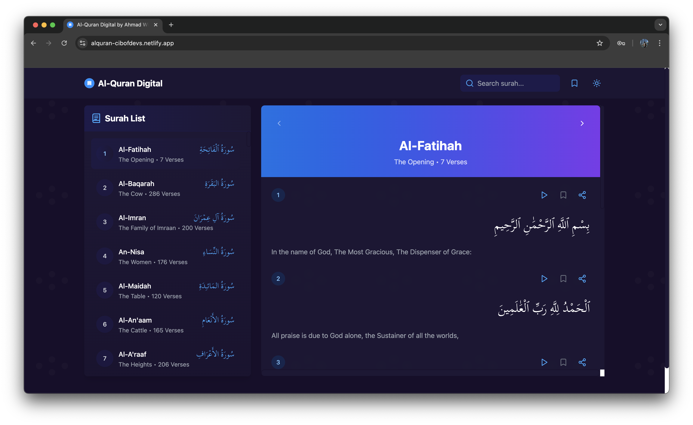

# Al-Quran Digital

A beautiful and feature-rich Al-Quran digital application built with React and TypeScript. Read, listen to, and bookmark verses from the Holy Quran with a clean and modern interface.



# Live Demo

🌐 Check out the live demonstration: https://alquran-cibofdevs.netlify.app

## Features

- 📖 Read the Quran with Arabic text and English translation
- 🎧 Listen to audio recitations by Mishary Rashid Alafasy
- 🔖 Bookmark your favorite verses
- 🌙 Dark mode support
- 🔍 Search through all surahs
- 📱 Fully responsive design
- ⚡ Fast and lightweight

## Tech Stack

- React 18
- TypeScript
- Tailwind CSS
- Vite
- Lucide Icons

## Getting Started

### Prerequisites

- Node.js 18 or higher
- npm or yarn

### Installation

1. Clone the repository:
```bash
git clone https://github.com/cibofdevs/alquran-digital.git
cd alquran-digital
```

2. Install dependencies:
```bash
npm install
```

3. Start the development server:
```bash
npm run dev
```

4. Open [http://localhost:5173](http://localhost:5173) to view it in the browser.

## API

This project uses the [Alquran.cloud API](https://alquran.cloud/api) to fetch Quran data.

## Contributing

Contributions are welcome! Please feel free to submit a Pull Request. For major changes, please open an issue first to discuss what you would like to change.

1. Fork the Project
2. Create your Feature Branch (`git checkout -b feature/AmazingFeature`)
3. Commit your Changes (`git commit -m 'Add some AmazingFeature'`)
4. Push to the Branch (`git push origin feature/AmazingFeature`)
5. Open a Pull Request

## License

This project is licensed under the MIT License - see the [LICENSE](LICENSE) file for details.

## Acknowledgments

- [Alquran.cloud](https://alquran.cloud) for providing the Quran API
- [Mishary Rashid Alafasy](https://misharialafasy.net) for the beautiful recitations
- All contributors and supporters of this project

## Support

If you like this project, please give it a ⭐️ on GitHub!